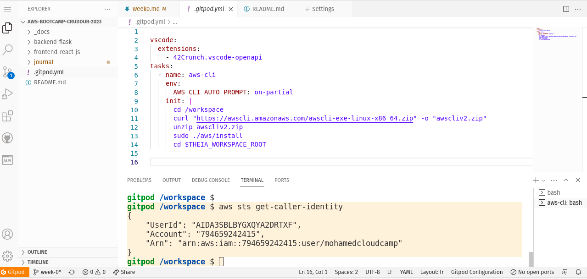

# Week 0 — Billing and Architecture

## Fix Gitpod Codespaces issue
-I was not able to push the branch week-0 due to an issue of authentification :
```sh
gitpod /workspace/aws-bootcamp-cruddur-2023 (week-0) $ sudo git push -u origin week-0
Username for 'https://github.com': belgasmi
Password for 'https://belgasmi@github.com': 
remote: Support for password authentication was removed on August 13, 2021.
remote: Please see https://docs.github.com/en/get-started/getting-started-with-git/about-remote-repositories#cloning-with-https-urls for information on currently recommended modes of authentication.
fatal: Authentication failed for 'https://github.com/belgasmi/aws-bootcamp-cruddur-2023.git/'
```

-I was able to solve the problem with the help of the link below :
https://github.com/gitpod-io/gitpod/issues/1315 
"You can solve it manually by navigating to https://gitpod.io/access-control/ and allowing write public repos"

## Required Homework/Tasks

### AWS CLI

#### Install AWS CLI

- On our GitPod environment, update `.gitpod.yml` to include the following task.

```sh
tasks:
  - name: aws-cli
    env:
      AWS_CLI_AUTO_PROMPT: on-partial
    init: |
      cd /workspace
      curl "https://awscli.amazonaws.com/awscli-exe-linux-x86_64.zip" -o "awscliv2.zip"
      unzip awscliv2.zip
      sudo ./aws/install
      cd $THEIA_WORKSPACE_ROOT
```

- Push the change to GitHub.

- Re'launch GitPod Codespaces

#### Create new User & Generate AWS Credentials

- Go to the [IAM Users Console](https://us-east-1.console.aws.amazon.com/iamv2/home?region=us-east-1#/users) and create a new user
- `Enable console access` for the user
- Create a new `Admin` Group and apply `AdministratorAccess`
- Create the user and go find and click into the user
- Click on `Security Credentials` and `Create Access Key`
- Choose AWS CLI Access
- Download the CSV with the credentials

- Fix the issue of access authorization for new user on [Account Interface](https://us-east-1.console.aws.amazon.com/billing/home?region=us-east-1&skipRegion=true#/account)

To fix the problem, I followed the instructions on the [IAM tutorial: Delegate access to the billing console](https://docs.aws.amazon.com/IAM/latest/UserGuide/tutorial_billing.html?icmpid=docs_iam_console) :

```sh
Activate access to billing data on my AWS account
Create IAM policies (BillingFullAccess & BillingViewAccess) that grant permissions to billing data  
Attach billing policies (BillingFullAccess) to your user group
```

#### Set Env Vars

We will set these credentials for the current bash terminal
```
export AWS_ACCESS_KEY_ID=""
export AWS_SECRET_ACCESS_KEY=""
export AWS_DEFAULT_REGION=us-east-1
```

We'll tell Gitpod to remember these credentials if we relaunch our workspaces
```
gp env AWS_ACCESS_KEY_ID=""
gp env AWS_SECRET_ACCESS_KEY=""
gp env AWS_DEFAULT_REGION=us-east-1
```

#### Test AWS CLI
Check that the AWS CLI is working and the user is the one expected (the IAM user created `mohamedcloudcamp` 

```sh
gitpod /workspace $ aws sts get-caller-identity
{
    "UserId": "AIDA3SBLBYGXQYA2DRTXF",
    "Account": "794659242415",
    "Arn": "arn:aws:iam::794659242415:user/mohamedcloudcamp"
}
```



### Recreate Cruddur Logical Diagram


[Lucid Charts Share Link](https://lucid.app/lucidchart/3697c32e-4a49-4518-8066-b12d57d6c5dd/edit?viewport_loc=-1384%2C-685%2C3150%2C1395%2C0_0&invitationId=inv_c7d489ab-9b15-4657-b969-21bb2cbb4dbf) 


