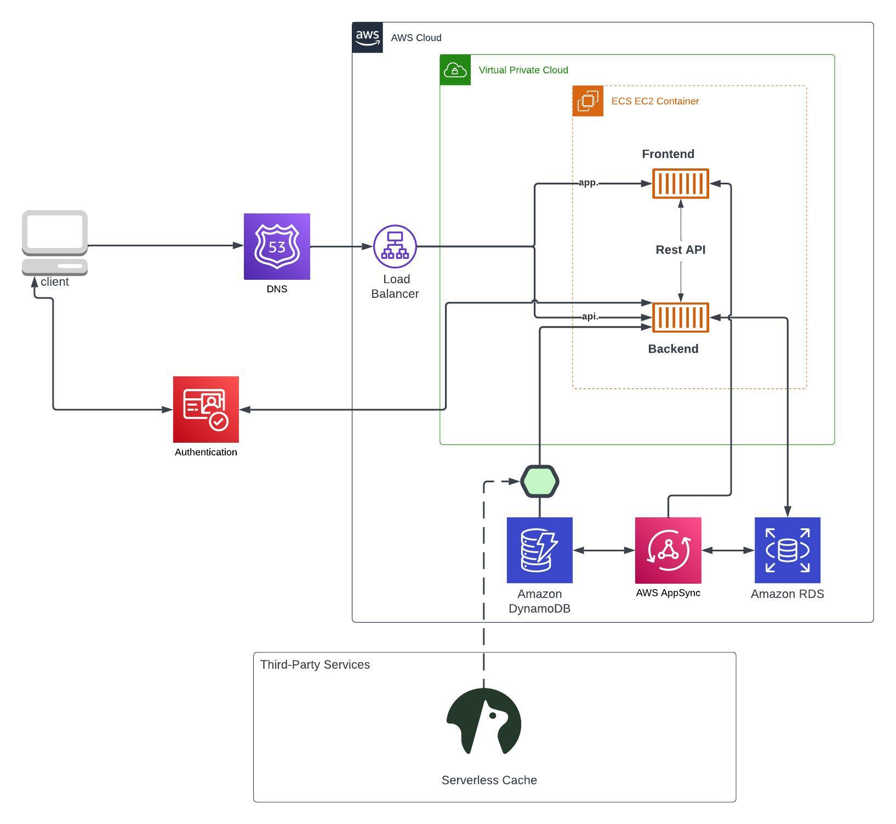

# Week 0 — Billing and Architecture

## Fix Gitpod Codespaces issue
-I was not able to push the branch week-0 due to an issue of authentification :
gitpod /workspace/aws-bootcamp-cruddur-2023 (week-0) $ sudo git push -u origin week-0
Username for 'https://github.com': belgasmi
Password for 'https://belgasmi@github.com': 
remote: Support for password authentication was removed on August 13, 2021.
remote: Please see https://docs.github.com/en/get-started/getting-started-with-git/about-remote-repositories#cloning-with-https-urls for information on currently recommended modes of authentication.
fatal: Authentication failed for 'https://github.com/belgasmi/aws-bootcamp-cruddur-2023.git/'

-I was able to solve the problem with the help of the link below :
https://github.com/gitpod-io/gitpod/issues/1315 
"You can solve it manually by navigating to https://gitpod.io/access-control/ and allowing write public repos"

## Required Homework/Tasks

### Recreate Cruddur Logical Diagram

[Lucid Charts Share Link](https://lucid.app/lucidchart/3697c32e-4a49-4518-8066-b12d57d6c5dd/edit?viewport_loc=-1384%2C-685%2C3150%2C1395%2C0_0&invitationId=inv_c7d489ab-9b15-4657-b969-21bb2cbb4dbf) 

