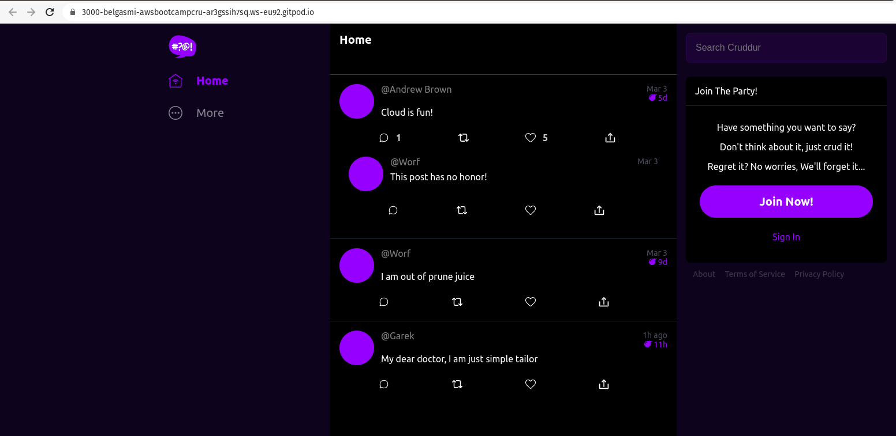
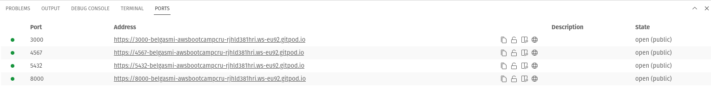

# Week 1 - App Containerization

## Extension Docker
Install "VSCode Docker Extension" on Gitpod.
>Makes it easy to create, manage, and debug containerized applications.

## Containerize Backend-flask 

### Run Python 

```sh
gitpod /workspace/aws-bootcamp-cruddur-2023 (week-1) $ cd backend-flask
gitpod /workspace/aws-bootcamp-cruddur-2023/backend-flask (week-1) $ export FRONTEND_URL="*"
gitpod /workspace/aws-bootcamp-cruddur-2023/backend-flask (week-1) $ export BACKEND_URL="*"
gitpod /workspace/aws-bootcamp-cruddur-2023/backend-flask (week-1) $ python3 -m flask run --host=0.0.0.0 --port=4567
/home/gitpod/.pyenv/versions/3.8.16/bin/python3: No module named flask
```

To fix the problem above, we should install the python librairies

```sh 
gitpod /workspace/aws-bootcamp-cruddur-2023/backend-flask (week-1) $ pip3 install -r requirements.txt 
Collecting flask
  Downloading Flask-2.2.3-py3-none-any.whl (101 kB)
     ━━━━━━━━━━━━━━━━━━━━━━━━━━━━━━━━━━━━━━━━ 101.8/101.8 kB 7.9 MB/s eta 0:00:00
Collecting flask-cors
  Downloading Flask_Cors-3.0.10-py2.py3-none-any.whl (14 kB)
Collecting itsdangerous>=2.0
  Downloading itsdangerous-2.1.2-py3-none-any.whl (15 kB)
Collecting Werkzeug>=2.2.2
  Downloading Werkzeug-2.2.3-py3-none-any.whl (233 kB)
     ━━━━━━━━━━━━━━━━━━━━━━━━━━━━━━━━━━━━━━━━ 233.6/233.6 kB 35.1 MB/s eta 0:00:00
Collecting click>=8.0
  Downloading click-8.1.3-py3-none-any.whl (96 kB)
     ━━━━━━━━━━━━━━━━━━━━━━━━━━━━━━━━━━━━━━━━ 96.6/96.6 kB 27.7 MB/s eta 0:00:00
Requirement already satisfied: Jinja2>=3.0 in /home/gitpod/.pyenv/versions/3.8.16/lib/python3.8/site-packages (from flask->-r requirements.txt (line 1)) (3.1.2)
Requirement already satisfied: importlib-metadata>=3.6.0 in /home/gitpod/.pyenv/versions/3.8.16/lib/python3.8/site-packages (from flask->-r requirements.txt (line 1)) (6.0.0)
Requirement already satisfied: Six in /home/gitpod/.pyenv/versions/3.8.16/lib/python3.8/site-packages (from flask-cors->-r requirements.txt (line 2)) (1.16.0)
Requirement already satisfied: zipp>=0.5 in /home/gitpod/.pyenv/versions/3.8.16/lib/python3.8/site-packages (from importlib-metadata>=3.6.0->flask->-r requirements.txt (line 1)) (3.11.0)
Requirement already satisfied: MarkupSafe>=2.0 in /home/gitpod/.pyenv/versions/3.8.16/lib/python3.8/site-packages (from Jinja2>=3.0->flask->-r requirements.txt (line 1)) (2.1.1)
Installing collected packages: Werkzeug, itsdangerous, click, flask, flask-cors
Successfully installed Werkzeug-2.2.3 click-8.1.3 flask-2.2.3 flask-cors-3.0.10 itsdangerous-2.1.2

[notice] A new release of pip available: 22.3.1 -> 23.0.1
[notice] To update, run: pip install --upgrade pip
```

### Run flask 
```sh 
gitpod /workspace/aws-bootcamp-cruddur-2023/backend-flask (week-1) $ python3 -m flask run --host=0.0.0.0 --port=4567
 * Debug mode: off
WARNING: This is a development server. Do not use it in a production deployment. Use a production WSGI server instead.
 * Running on all addresses (0.0.0.0)
 * Running on http://127.0.0.1:4567
 * Running on http://10.0.5.2:4567
Press CTRL+C to quit
```

### URL on browser
Unlock the port on the port tab.
>URL=https://4567-belgasmi-awsbootcampcru-ar3gssih7sq.ws-eu89.gitpod.io 
>CodeSpace=https://belgasmi-awsbootcampcru-ar3gssih7sq.ws-eu89.gitpod.io

```sh
Not Found
The requested URL was not found on the server. If you entered the URL manually please check your spelling and try again.
```


append to the url `/api/activities/home`
`https://4567-belgasmi-awsbootcampcru-ar3gssih7sq.ws-eu89.gitpod.io/api/activities/home`


all the json file

```json 
// 20230307211005
// https://4567-belgasmi-awsbootcampcru-ar3gssih7sq.ws-eu89.gitpod.io/api/activities/home

[
  {
    "created_at": "2023-03-05T20:10:05.118857+00:00",
    "expires_at": "2023-03-12T20:10:05.118857+00:00",
    "handle": "Andrew Brown",
    "likes_count": 5,
    "message": "Cloud is fun!",
    "replies": [
      {
        "created_at": "2023-03-05T20:10:05.118857+00:00",
        "handle": "Worf",
        "likes_count": 0,
        "message": "This post has no honor!",
        "replies_count": 0,
        "reply_to_activity_uuid": "68f126b0-1ceb-4a33-88be-d90fa7109eee",
        "reposts_count": 0,
        "uuid": "26e12864-1c26-5c3a-9658-97a10f8fea67"
      }
    ],
    "replies_count": 1,
    "reposts_count": 0,
    "uuid": "68f126b0-1ceb-4a33-88be-d90fa7109eee"
  },
  {
    "created_at": "2023-02-28T20:10:05.118857+00:00",
    "expires_at": "2023-03-16T20:10:05.118857+00:00",
    "handle": "Worf",
    "likes": 0,
    "message": "I am out of prune juice",
    "replies": [
      
    ],
    "uuid": "66e12864-8c26-4c3a-9658-95a10f8fea67"
  },
  {
    "created_at": "2023-03-07T19:10:05.118857+00:00",
    "expires_at": "2023-03-08T08:10:05.118857+00:00",
    "handle": "Garek",
    "likes": 0,
    "message": "My dear doctor, I am just simple tailor",
    "replies": [
      
    ],
    "uuid": "248959df-3079-4947-b847-9e0892d1bab4"
  }
]
```

### Add Dockerfile
Create `backend-flask/Dockerfile` with the content :

```sh
FROM python:3.10-slim-buster
WORKDIR /backend-flask
COPY requirements.txt requirements.txt
RUN pip3 install -r requirements.txt
COPY . .
ENV FLASK_ENV=development
EXPOSE ${PORT}
CMD ["python3", "-m", "flask", "run", "--host=0.0.0.0", "--port=4567"]
```

### Build Container 
build tag `backend-flask` with the Dockerfile in the directory `./backend-flask`

```sh 
gitpod /workspace/aws-bootcamp-cruddur-2023 (week-1) $ docker build -t backend-flask ./backend-flask/
Sending build context to Docker daemon   55.3kB
Step 1/8 : FROM python:3.10-slim-buster
 ---> 9ab67b0788d8
Step 2/8 : WORKDIR /backend-flask
 ---> Using cache
 ---> 726546cacb78
Step 3/8 : COPY requirements.txt requirements.txt
 ---> Using cache
 ---> f81022507f20
Step 4/8 : RUN pip3 install -r requirements.txt
 ---> Running in b146c0b8a9e6
Collecting flask
  Downloading Flask-2.2.3-py3-none-any.whl (101 kB)
     ━━━━━━━━━━━━━━━━━━━━━━━━━━━━━━━━━━━━━━━ 101.8/101.8 kB 6.2 MB/s eta 0:00:00
Collecting flask-cors
  Downloading Flask_Cors-3.0.10-py2.py3-none-any.whl (14 kB)
Collecting click>=8.0
  Downloading click-8.1.3-py3-none-any.whl (96 kB)
     ━━━━━━━━━━━━━━━━━━━━━━━━━━━━━━━━━━━━━━━━ 96.6/96.6 kB 16.7 MB/s eta 0:00:00
Collecting Jinja2>=3.0
  Downloading Jinja2-3.1.2-py3-none-any.whl (133 kB)
     ━━━━━━━━━━━━━━━━━━━━━━━━━━━━━━━━━━━━━━ 133.1/133.1 kB 40.1 MB/s eta 0:00:00
Collecting itsdangerous>=2.0
  Downloading itsdangerous-2.1.2-py3-none-any.whl (15 kB)
Collecting Werkzeug>=2.2.2
  Downloading Werkzeug-2.2.3-py3-none-any.whl (233 kB)
     ━━━━━━━━━━━━━━━━━━━━━━━━━━━━━━━━━━━━━━ 233.6/233.6 kB 67.9 MB/s eta 0:00:00
Collecting Six
  Downloading six-1.16.0-py2.py3-none-any.whl (11 kB)
Collecting MarkupSafe>=2.0
  Downloading MarkupSafe-2.1.2-cp310-cp310-manylinux_2_17_x86_64.manylinux2014_x86_64.whl (25 kB)
Installing collected packages: Six, MarkupSafe, itsdangerous, click, Werkzeug, Jinja2, flask, flask-cors
Successfully installed Jinja2-3.1.2 MarkupSafe-2.1.2 Six-1.16.0 Werkzeug-2.2.3 click-8.1.3 flask-2.2.3 flask-cors-3.0.10 itsdangerous-2.1.2
WARNING: Running pip as the 'root' user can result in broken permissions and conflicting behaviour with the system package manager. It is recommended to use a virtual environment instead: https://pip.pypa.io/warnings/venv

[notice] A new release of pip available: 22.3.1 -> 23.0.1
[notice] To update, run: pip install --upgrade pip
Removing intermediate container b146c0b8a9e6
 ---> 7d143d7fd264
Step 5/8 : COPY . .
 ---> 52145e2c2636
Step 6/8 : ENV FLASK_ENV=development
 ---> Running in f57b95d1cbd1
Removing intermediate container f57b95d1cbd1
 ---> 769bc967058b
Step 7/8 : EXPOSE ${PORT}
 ---> Running in 3856751a9f37
Removing intermediate container 3856751a9f37
 ---> 095804d84eab
Step 8/8 : CMD ["python3", "-m", "flask", "run", "--host=0.0.0.0", "--port=4567"]
 ---> Running in ccbab414f74f
Removing intermediate container ccbab414f74f
 ---> 48e3270b260f
Successfully built 48e3270b260f
Successfully tagged backend-flask:latest
```

### List image 
```sh
gitpod /workspace/aws-bootcamp-cruddur-2023 (week-1) $ docker image ls
REPOSITORY      TAG                IMAGE ID       CREATED         SIZE
backend-flask   latest             48e3270b260f   5 minutes ago   129MB
python          3.10-slim-buster   9ab67b0788d8   6 days ago      118MB
``` 

### Run Container
`docker run --rm -p 4567:4567 -d -it backend-flask`
 
get container info
 
```sh
gitpod /workspace/aws-bootcamp-cruddur-2023 (week-1) $ docker ps 
CONTAINER ID   IMAGE           COMMAND                  CREATED          STATUS          PORTS                                       NAMES
6f08ef9380d5   backend-flask   "python3 -m flask ru…"   23 minutes ago   Up 23 minutes   0.0.0.0:4567->4567/tcp, :::4567->4567/tcp   tender_cartwright
```

### Backend TypeError
`https://4567-belgasmi-awsbootcampcru-ar3gssih7sq.ws-eu89b.gitpod.io/api/activities/`


### Container Env Vars  

#### Add URLs Env Vars
- To fix the issue of TypeError, we should add the URLs variables

```sh
gitpod /workspace/aws-bootcamp-cruddur-2023 (week-1) $ docker run --rm -p 4567:4567 -it backend-flask -e BACKEND_URL=$BACKEND_URL -e FRONTEND_URL=$FRONTEND_URL 
docker: Error response from daemon: failed to create shim task: OCI runtime create failed: runc create failed: unable to start container process: exec: "-e": executable file not found in $PATH: unknown.
```
-> KO => change position of -e param 

```sh
$ docker run --rm -e BACKEND_URL=* -e FRONTEND_URL=* -p 4567:4567 -it backend-flask 
```
-> OK

```sh
$ export FRONTEND_URL="*"
$ export BACKEND_URL="*"
$ docker run --rm -e BACKEND_URL=$BACKEND_URL -e FRONTEND_URL=$FRONTEND_URL -p 4567:4567 -it backend-flask
```
-> OK 

```sh
gitpod /workspace/aws-bootcamp-cruddur-2023 (week-1) $ docker ps
CONTAINER ID   IMAGE           COMMAND                  CREATED          STATUS          PORTS                                       NAMES
6a211046b63b   backend-flask   "python3 -m flask ru…"   12 minutes ago   Up 12 minutes   0.0.0.0:4567->4567/tcp, :::4567->4567/tcp   silly_burnell
gitpod /workspace/aws-bootcamp-cruddur-2023 (week-1) $ 
```

### Access Container 
```sh
gitpod /workspace/aws-bootcamp-cruddur-2023 (week-1) $ docker exec -it 6a211046b63b /bin/bash
root@6a211046b63b:/backend-flask# env | grep _URL
FRONTEND_URL=*
BACKEND_URL=*
PYTHON_GET_PIP_URL=https://github.com/pypa/get-pip/raw/d5cb0afaf23b8520f1bbcfed521017b4a95f5c01/public/get-pip.py
root@6a211046b63b:/backend-flask# 
```

### Curl
Send Curl to Test Server

```sh
gitpod /workspace/aws-bootcamp-cruddur-2023 (week-1) $ curl -X GET http://localhost:4567/api/activities/home -H "Accept: application/json" -H "Content-Type: application/json"
[
  {
    "created_at": "2023-03-06T21:05:40.883712+00:00",
    "expires_at": "2023-03-13T21:05:40.883712+00:00",
```

### Check Container Logs

Different way to get logs : 

```sh
$ docker logs CONTAINER_ID -f
$ docker logs backend-flask -f
$ docker logs $CONTAINER_ID -f
```

```sh
gitpod /workspace/aws-bootcamp-cruddur-2023 (week-1) $ docker logs 6a211046b63b -f
'FLASK_ENV' is deprecated and will not be used in Flask 2.3. Use 'FLASK_DEBUG' instead.
'FLASK_ENV' is deprecated and will not be used in Flask 2.3. Use 'FLASK_DEBUG' instead.
'FLASK_ENV' is deprecated and will not be used in Flask 2.3. Use 'FLASK_DEBUG' instead.
 * Debug mode: on
WARNING: This is a development server. Do not use it in a production deployment. Use a production WSGI server instead.
 * Running on all addresses (0.0.0.0)
 * Running on http://127.0.0.1:4567
 * Running on http://172.17.0.2:4567
Press CTRL+C to quit
 * Restarting with stat
'FLASK_ENV' is deprecated and will not be used in Flask 2.3. Use 'FLASK_DEBUG' instead.
'FLASK_ENV' is deprecated and will not be used in Flask 2.3. Use 'FLASK_DEBUG' instead.
'FLASK_ENV' is deprecated and will not be used in Flask 2.3. Use 'FLASK_DEBUG' instead.
 * Debugger is active!
 * Debugger PIN: 453-252-751
192.168.5.135 - - [08/Mar/2023 20:40:32] "GET /api/activities/home HTTP/1.1" 200 -
192.168.5.135 - - [08/Mar/2023 20:40:46] "GET /api/activities/home HTTP/1.1" 200 -
192.168.5.135 - - [08/Mar/2023 20:40:53] "GET /api/activities/home HTTP/1.1" 200 -
192.168.5.135 - - [08/Mar/2023 20:40:54] "GET /api/activities/home HTTP/1.1" 200 -
192.168.5.135 - - [08/Mar/2023 20:40:54] "GET /api/activities/home HTTP/1.1" 200 -
172.17.0.1 - - [08/Mar/2023 21:05:40] "GET /api/activities/home HTTP/1.1" 200 -
```

## Containerize Frontend-React
### dockerfile
add the content below to `frontend-react-js/Dockerfile`

```Dockerfile
FROM node:16.18

ENV PORT=3000

COPY . /frontend-react-js
WORKDIR /frontend-react-js
RUN npm install
EXPOSE ${PORT}
CMD ["npm", "start"]
```

#### build
```sh
$ docker build -t front-react-js frontend-react-js/
$ docker images
REPOSITORY       TAG       IMAGE ID       CREATED             SIZE
front-react-js   latest    41d068630e72   3 minutes ago       1.2GB
```

#### run
```sh
$ docker run --name front -p 3000:3000 -d --rm front-react-js
$ docker ps -a
CONTAINER ID   IMAGE            COMMAND                  CREATED         STATUS                     PORTS     NAMES
72fdd5f91b88   front-react-js   "docker-entrypoint.s…"   2 minutes ago   Exited (1) 2 minutes ago             front
```


## DockerHub
Push and tag an image to DockerHub

### build
```sh
$ docker build -t  backend-flask ./backend-flask
..
Successfully built 48e3270b260f
Successfully tagged backend-flask:latest
```

### tag
```sh
$ docker tag backend-flask:latest belgasmi/backend-flask:v1-release 
$ docker image ls
REPOSITORY               TAG                IMAGE ID       CREATED       SIZE
belgasmi/backend-flask   v1-release         48e3270b260f   6 days ago    129MB
backend-flask            latest             48e3270b260f   6 days ago    129MB
```

### push
```sh
$ docker login 
$ docker push belgasmi/backend-flask:v1-release
```


### Dockerfile Multistage
Use multi-stage build in Dockerfile to :
- reduce the number of dependencies in the image 
- reduce security vulnerabilities
- keep the build clean & lean to run the application in production environment 

```Dockerfile
FROM node:16.18 AS stage
RUN echo "staging build"
COPY . /frontend-react-js
WORKDIR /frontend-react-js
RUN npm install

FROM node:16.18 
RUN echo "production build"
ENV PORT=3000
WORKDIR /frontend-react-js
COPY --from=stage /frontend-react-js/node_modules /frontend-react-js/node_modules
COPY . .
EXPOSE ${PORT}
CMD ["npm", "start"]
```

```sh
$ docker images
REPOSITORY       TAG       IMAGE ID       CREATED              SIZE
front-react-js   latest    89cf3beec565   About a minute ago   1.15GB
```
> gain 50MB

## Multiple containers
- create `docker-compose.yml` file at the root of cruddur project
- add healthcheck for frontend-react-js service to determine whether or not container for this service is “healthy”

```sh
version: "3.8"
services:
  backend-flask:
    environment:
      FRONTEND_URL: "https://3000-${GITPOD_WORKSPACE_ID}.${GITPOD_WORKSPACE_CLUSTER_HOST}"
      BACKEND_URL: "https://4567-${GITPOD_WORKSPACE_ID}.${GITPOD_WORKSPACE_CLUSTER_HOST}"
    build: ./backend-flask
    ports:
      - "4567:4567"
    volumes:
      - ./backend-flask:/backend-flask
  frontend-react-js:
    environment:
      REACT_APP_BACKEND_URL: "https://4567-${GITPOD_WORKSPACE_ID}.${GITPOD_WORKSPACE_CLUSTER_HOST}"
    build: ./frontend-react-js
    ports:
      - "3000:3000"
    volumes:
      - ./frontend-react-js:/frontend-react-js
    healthcheck:
      test: ["CMD", "curl", "-f", "http://localhost:3000"]
      interval: 1m30s
      timeout: 10s
      retries: 3
      start_period: 40s

# the name flag is a hack to change the default prepend folderhealthcheck
# name when outputting the image names
networks: 
  internal-network:
    driver: bridge
    name: cruddur
 ```
 
 
 
 
## Endpoint Backend
### OpenAPI
Document the notification endpoint for the OpenAI file.
Add the path notifications to `./backend-flask/openapi-3.0.yml`

```sh
/api/activities/notifications:
    get:
      description: 'Return a feed of activity for all of those that I follow'
      tags:
        - activities
      parameters: []
      responses:
        '200':
          description: Returns an array of activities
          content:
            application/json:
              schema:
                type: array
                items:
                  $ref: '#/components/schemas/Activity'
```

### Notification feature
Create the notification feature for backend 
Write a flask backend endpoint for notifications

#### notifications_activities.py
```sh
from datetime import datetime, timedelta, timezone
class NotificationsActivities:
  def run():
    now = datetime.now(timezone.utc).astimezone()
    results = [{
      'uuid': '68f126b0-1ceb-4a33-88be-d90fa7109eee',
      'handle':  'coco',
      'message': 'I am white unicorn',
      'created_at': (now - timedelta(days=2)).isoformat(),
      'expires_at': (now + timedelta(days=5)).isoformat(),
      'likes_count': 5,
      'replies_count': 1,
      'reposts_count': 0,
      'replies': [{
        'uuid': '26e12864-1c26-5c3a-9658-97a10f8fea67',
        'reply_to_activity_uuid': '68f126b0-1ceb-4a33-88be-d90fa7109eee',
        'handle':  'worf',
        'message': 'this post has no honor!',
        'likes_count': 0,
        'replies_count': 0,
        'reposts_count': 0,
        'created_at': (now - timedelta(days=2)).isoformat()
      }],
    }
    ]
    return results
```

#### app.py
```sh
@app.route("/api/activities/notifications", methods=['GET'])
def data_notifications():
  data = NotificationsActivities.run()
  return data, 200
``` 

## Endpoint Front
Create the notification feature for front
Write a react page for notifications 

### NotificationsFeedPage.css

### NotificationsFeedPage.js
```js
import './NotificationsFeedPage.css';
import React from "react";

import DesktopNavigation  from '../components/DesktopNavigation';
import DesktopSidebar     from '../components/DesktopSidebar';
import ActivityFeed from '../components/ActivityFeed';
import ActivityForm from '../components/ActivityForm';
import ReplyForm from '../components/ReplyForm';

// [TODO] Authenication
import Cookies from 'js-cookie'

export default function NotificationsFeedPage() {
  const [activities, setActivities] = React.useState([]);
  const [popped, setPopped] = React.useState(false);
  const [poppedReply, setPoppedReply] = React.useState(false);
  const [replyActivity, setReplyActivity] = React.useState({});
  const [user, setUser] = React.useState(null);
  const dataFetchedRef = React.useRef(false);

  const loadData = async () => {
    try {
      const backend_url = `${process.env.REACT_APP_BACKEND_URL}/api/activities/notifications`
      const res = await fetch(backend_url, {
        method: "GET"
      });
      let resJson = await res.json();
      if (res.status === 200) {
        setActivities(resJson)
      } else {
        console.log(res)
      }
    } catch (err) {
      console.log(err);
    }
  };

  const checkAuth = async () => {
    console.log('checkAuth')
    // [TODO] Authenication
    if (Cookies.get('user.logged_in')) {
      setUser({
        display_name: Cookies.get('user.name'),
        handle: Cookies.get('user.username')
      })
    }
  };

  React.useEffect(()=>{
    //prevents double call
    if (dataFetchedRef.current) return;
    dataFetchedRef.current = true;

    loadData();
    checkAuth();
  }, [])

  return (
    <article>
      <DesktopNavigation user={user} active={'notifications'} setPopped={setPopped} />
      <div className='content'>
        <ActivityForm  
          popped={popped}
          setPopped={setPopped} 
          setActivities={setActivities} 
        />
        <ReplyForm 
          activity={replyActivity} 
          popped={poppedReply} 
          setPopped={setPoppedReply} 
          setActivities={setActivities} 
          activities={activities} 
        /> 
        <ActivityFeed 
          title="Notifications" 
          setReplyActivity={setReplyActivity} 
          setPopped={setPoppedReply} 
          activities={activities} 
        />
      </div>
      <DesktopSidebar user={user} />
    </article>
  );
}
```
### App.js
Update with :

```js
import NotificationsFeedPage from './pages/NotificationsFeedPage';
{
path: "/notifications",
element: <NotificationsFeedPage />
},
```

### View


## Data

### Docker-compose
#### Service postgres / dynamodb 
```sh
version: "3.8"
services:
  backend-flask:
    environment:
      FRONTEND_URL: "https://3000-${GITPOD_WORKSPACE_ID}.${GITPOD_WORKSPACE_CLUSTER_HOST}"
      BACKEND_URL: "https://4567-${GITPOD_WORKSPACE_ID}.${GITPOD_WORKSPACE_CLUSTER_HOST}"
    build: ./backend-flask
    ports:
      - "4567:4567"
    volumes:
      - ./backend-flask:/backend-flask
  frontend-react-js:
    environment:
      REACT_APP_BACKEND_URL: "https://4567-${GITPOD_WORKSPACE_ID}.${GITPOD_WORKSPACE_CLUSTER_HOST}"
    build: ./frontend-react-js
    ports:
      - "3000:3000"
    volumes:
      - ./frontend-react-js:/frontend-react-js
    healthcheck:
      test: ["CMD", "curl", "-f", "http://localhost:3000"]
      interval: 1m30s
      timeout: 10s
      retries: 3
      start_period: 40s
  dynamodb-local:
    # https://stackoverflow.com/questions/67533058/persist-local-dynamodb-data-in-volumes-lack-permission-unable-to-open-databa
    # We needed to add user:root to get this working.
    user: root
    command: "-jar DynamoDBLocal.jar -sharedDb -dbPath ./data"
    image: "amazon/dynamodb-local:latest"
    container_name: dynamodb-local
    ports:
      - "8000:8000"
    volumes:
      - "./docker/dynamodb:/home/dynamodblocal/data"
    working_dir: /home/dynamodblocal
  db:
    image: postgres:13-alpine
    restart: always
    environment:
      - POSTGRES_USER=postgres
      - POSTGRES_PASSWORD=password
    ports:
      - '5432:5432'
    volumes: 
      - db:/var/lib/postgresql/data

# the name flag is a hack to change the default prepend folder
# name when outputting the image names
networks: 
  internal-network:
    driver: bridge
    name: cruddur
volumes:
  db:
    driver: local
```

#### Volumes
- Directory volume mapping :

```sh
volumes: 
- "./docker/dynamodb:/home/dynamodblocal/data"
```

- Named volume mapping :

```sh 
  volumes: 
    - db:/var/lib/postgresql/data
volumes:
  db:
    driver: local
```

#### Run Container
```sh
docker-compose up 
```

#### Ports


### DynamoDB
[DynamoDB Local](https://docs.aws.amazon.com/amazondynamodb/latest/developerguide/DynamoDBLocal.html)
[Tools CLI](https://docs.aws.amazon.com/amazondynamodb/latest/developerguide/Tools.CLI.html)

[Example of using DynamoDB local](https://github.com/100DaysOfCloud/challenge-dynamodb-local)

#### Create a table
```sh
aws dynamodb create-table \
    --endpoint-url http://localhost:8000 \
    --table-name Music \
    --attribute-definitions \
        AttributeName=Artist,AttributeType=S \
        AttributeName=SongTitle,AttributeType=S \
    --key-schema AttributeName=Artist,KeyType=HASH AttributeName=SongTitle,KeyType=RANGE \
    --provisioned-throughput ReadCapacityUnits=1,WriteCapacityUnits=1 \
    --table-class STANDARD
```

#### Create an Item
```sh
aws dynamodb put-item \
    --endpoint-url http://localhost:8000 \
    --table-name Music \
    --item \
        '{"Artist": {"S": "No One You Know"}, "SongTitle": {"S": "Call Me Today"}, "AlbumTitle": {"S": "Somewhat Famous"}}' \
    --return-consumed-capacity TOTAL  
```

#### List Tables
```sh
aws dynamodb list-tables --endpoint-url http://localhost:8000
```

#### Get Records
```sh
aws dynamodb scan --table-name cruddur_cruds --query "Items" --endpoint-url http://localhost:8000
```

### PostGreSQL
#### Install
- update .gitpod.yml :
	* install package postgres
	* extension to add explorer for postgres client 

```sh
- name: postgres
    init: |
      curl -fsSL https://www.postgresql.org/media/keys/ACCC4CF8.asc|sudo gpg --dearmor -o /etc/apt/trusted.gpg.d/postgresql.gpg
      echo "deb http://apt.postgresql.org/pub/repos/apt/ `lsb_release -cs`-pgdg main" |sudo tee  /etc/apt/sources.list.d/pgdg.list
      sudo apt update
      sudo apt install -y postgresql-client-13 libpq-dev
vscode:
  extensions:
    - cweijan.vscode-postgresql-client2
```
- reload gitpod


#### Connection


#### Run Postgres
```sh
$ psql -Upostgres --host localhost
```

## Git
add to .gitignore :

```sh
docker/**/*
```

Commit :
- via gitpod interface
or
- commands

```sh
$ git add .
$ git commit -m "week-1 message"
$ git push -u origin week-1
$ git checkout master
$ git merge week-1
$ git push -u origin master
```
